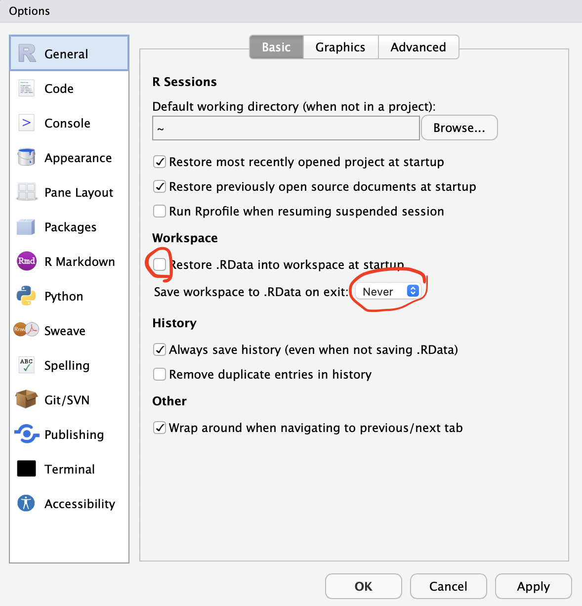

# *slendr* simulation crash course at Globe (2023)
<!--
### You can find the slides [here](https://quartopub.com/sites/979368fd-4892-4010-8a6d-a3bf8563ac99).

### [Here](https://quartopub.com/sites/99c8c3a2-8c9e-40ea-851f-c467e8759ba8) is a render of the slides as a single HTML page (easier for reference). -->

This README describes how to set up your machine for the tutorial. After you're done installing _slendr_, make sure to run a small testing simulation ([here](#testing-the-setup)) to check that everything works as needed. **Only run that script after you have everything successfully installed!**

------------------------------------------------------------------------

# Installation instructions

### Prerequisites

-   Working [R installation](https://cloud.r-project.org)(at least R 3.6)
-   [RStudio](https://www.rstudio.com/products/rstudio/download/) highly recommended but not required (it just makes it easier to inspect plots)
-   macOS / Linux / Windows (the latter won't support SLiM-based simulations, but we won't be doing those)

### Installing *slendr*

Getting *slendr* to work is important. The whole tutorial will be dedicated to this package.

You can install *slendr* by pasting this command into your R console:

    install.packages("slendr")

After installation succeds (see below in case it doesn't), load *slendr* itself:

    library(slendr)

This will very likely write a message that:

1.  you are missing SLiM -- this is OK, feel free to ignore this

2.  you are missing a Python environment -- we will fix this in the next step.

Next, run the following command. This will ask for permission to install an isolated Python mini-environment just for *slendr* -- this won't affect your other Python installations at all, so don't be afraid to confirm this!

    setup_env()

Finally, make sure you get a positive confirmation from the following check:

    check_env()

**On future occasions, you will have to call `init_env()` after running `library(slendr)`!**

## If any of the above fails

Sometimes on Linux or Mac a header library of some kind is missing, which is important for some R package which is internally used by _slendr_. If that happens, `install.packages("slendr")` will fail with an error.

If you use Mac and have [Homebrew](https://brew.sh) (I cannot recommend it enough! and not just for this), you can run [this command](https://www.slendr.net/articles/vignette-00-installation.html#macos). If you're running something Ubuntu/Debian-like and have problems with the installation, [this](https://www.slendr.net/articles/vignette-00-installation.html#linux) might help.

In case of persistent problems, please get in touch at `contact@bodkan.net`, pasting the error you got in an email. I'm happy to help you in person (I'm on vacation March 13-17 but there will be enough time to solve issues before the workshop).

**Most importantly:** Don't panic! :) I have seen the strangest things happen on people's computers while teaching _slendr_ and there was not one instance where we didn't get it to work. :)

## Testing the setup

Copy the following script to your R session after you successfully installed your R dependencies as described above.

First run this:

    library(slendr)
    init_env()

Followed by this:

    o <- population("outgroup", time = 1, N = 100)
    b <- population("b", parent = o, time = 500, N = 100)
    c <- population("c", parent = b, time = 1000, N = 100)
    x1 <- population("x1", parent = c, time = 2000, N = 100)
    x2 <- population("x2", parent = c, time = 2000, N = 100)
    a <- population("a", parent = b, time = 1500, N = 100)

    gf <- gene_flow(from = b, to = x1, start = 2100, end = 2150, rate = 0.1)

    model <- compile_model(
      populations = list(a, b, x1, x2, c, o), gene_flow = gf,
      generation_time = 1, simulation_length = 2200
    )

    ts <- msprime(model, sequence_length = 1e6, recombination_rate = 1e-8)

    ts_samples(ts)

If this runs without error and you get a small summary table with simulated samples, you're all set!

# Other R package dependencies

We will use some tidyverse packages for analysis and plotting.

I recommend you install the following packages in addition to _slendr_:

    install.packages(c("dplyr", "ggplot2", "cowplot", "magrittr"))

# Python+RStudio issue

RStudio sometimes interferes with Python setup needed for simulation. To fix this, go to `Tools` -\> `Global Options` in RStudio and set the following options:

A friendly note: you should always do the above, even outside of this workshop. Keeping `.RData` files around breaks reproducibility of your work. Never use them!
